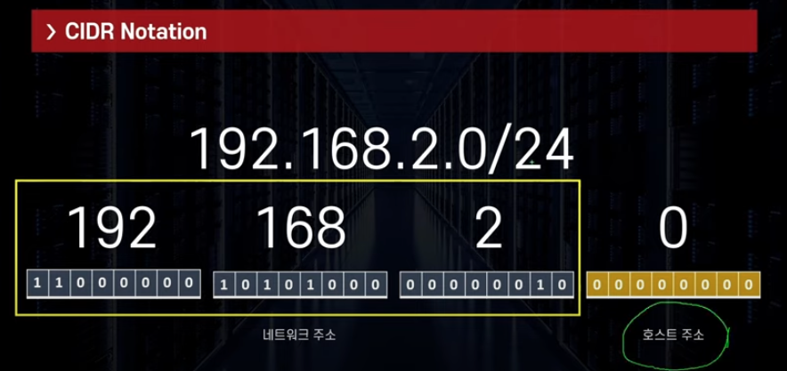

## CIDR
```commandline
- Classless Inter Domain Routing 약자
- IP 주소를 여러 네크워크 영역으로 나누기 위해 IP를 묶는 방식
- 여러 개의 사설망을 구축하기 위해 망을 나누는 방법
- A.B.C.D/E 형식
    ㄴ 10.0.1.0/24, 172.0.0.1/12
```

### CIDR Notation
```commandline
- CIDR Notation는 IP 주소의 집합
192.168.2.0/24 일 때

32bit = 24bit 네트워크 주소 ( 고정 값 )
        8bit 호스트 주소 ( 변동 값 )

192.168.2.0 ~ 192.168.0.255 까지 256개 IP 할당 가능        
 
```


<br/>

### Base 사설 IP
EX) 10.0.0.0, 172.0.0.1, 192.168.0.0 ...

### Subnet Mask
얼마나 많은 IP를 보유할 수 있는지 bits를 통해 정의한다
- /8 - 255.0.0.0
- /16 - 255.255.0.0
- /24 - 255.255.255.0
- /32 - 255.255.255.255


### CIDR 예시
192.168.0.0/24 = 192.168.0.0 ~ 192.168.255 ( 256개 )
192.168.0.0/16 = 192.168.0.0 ~ 192.255.255 ( 65,536 개 )