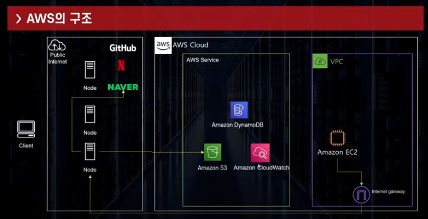
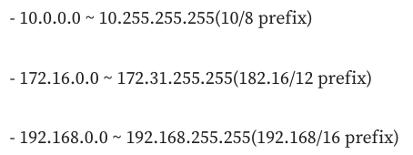

## VPC
```commandline
- 가상의 사설망 ( Virtual Private Cloud )
- 원칙적으로는 격리된 네트워크로 외부에서/외부로 접근 불가능
    ㄴ but EC2는 IGW로 VPC->외부로 접근
- VPC는 하나의 Region에 종속
- 각각의 VPC는 독립적인 네트워크

```

<br/>

### VPC 구성요소
```commandline
- 서브넷
- NACL/보안그룹
- 라우트 테이블
- 인터넷 게이트웨이 (IGW)
- 넷 게이트웨이 (NatGW)
- VPC Endpoint
```

### VPC 사용 사설 아이피 대역

