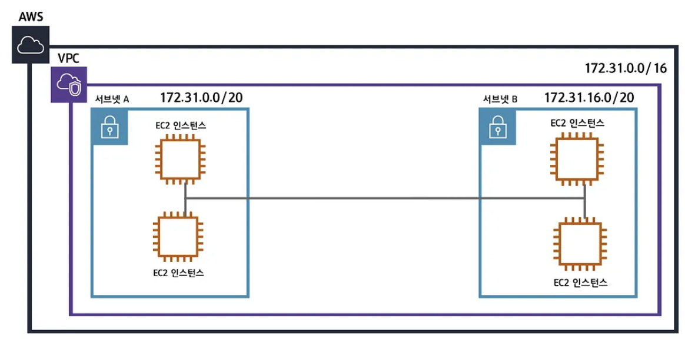
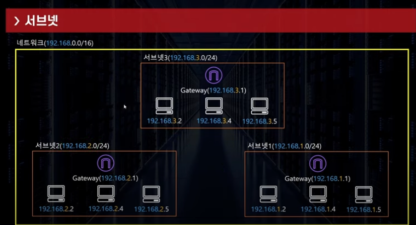
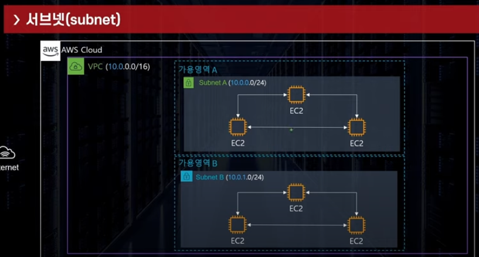
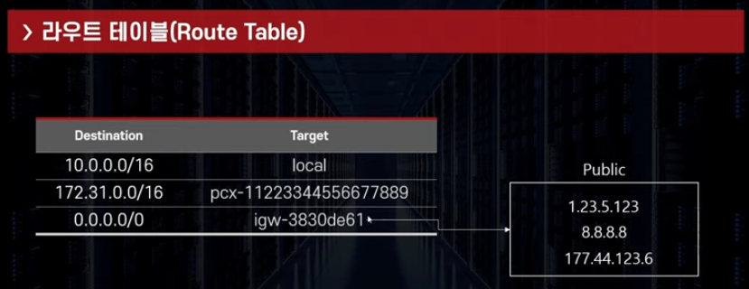
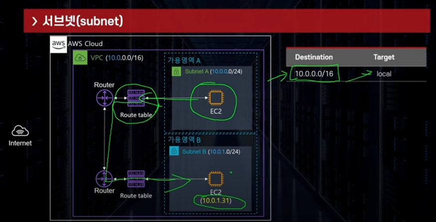

## Subnet
```commandline
- VPC를 나누는 단위 ( VPC 하위 단위 )
- 더 많은 네트워크망을 만들기 위함
- 하나의 서브넷은 하나의 가용영역(AZ)안에 위치
- 일정 IP 주소의 범위를 보유 ( CIDR Notation )
    ㄴ 큰 네트워크에 부여된 IP범위를 쪼개어 작은 단위의 서브넷에 할당
```



<br/>

### Subnet IP 갯수
```commandline
- 5개는 제외하고 계산
- 10.0.0./24 라면
    ㄴ 10.0.0.0 : network address
    ㄴ 10.0.0.1 : VPC Router
    ㄴ 10.0.0.2 : DNS Server
    ㄴ 10.0.0.3 : 미래를 위해 AWS에서 남겨둠
    ㄴ 10.0.0.255 : network broadcast address (브로드캐스트 지원은 안함)
```
<br/>

### Route Table
```commandline
- 트래픽이 어디로 가야 할지 알려주는 이정표
- VPC 생성시 기본으로 하나 제공
- 2개 이상 테이블 데이터와 매칭시 더 구체적인 destination으로 매칭
```


<br/>

### Subnet 종류
```commandline
- 퍼블릭 서브넷
    ㄴ 외부에서 인터넷(IGW)을 통해 연결할 수 있는 서브넷
    ㄴ 위치한 인스턴스에 public ip 부여 가는
    ㄴ 웹서버, 유저에게 노출되어야 하는 인프라
- 프라이빗 서브넷
    ㄴ 외부 인터넷으로 경로가 없음
    ㄴ public ip 부여 불가능
    ㄴ Database, 외부에 노출 될 필요가 없는 인프라
```