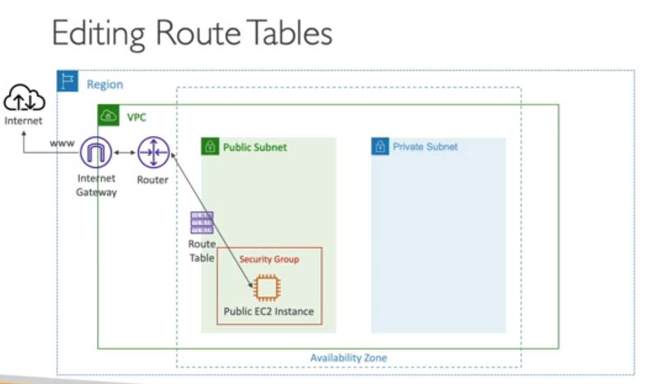
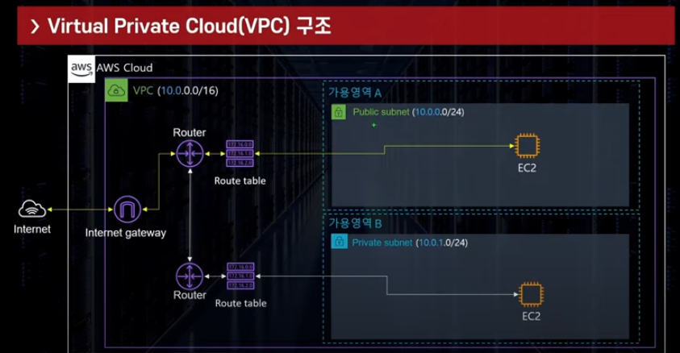
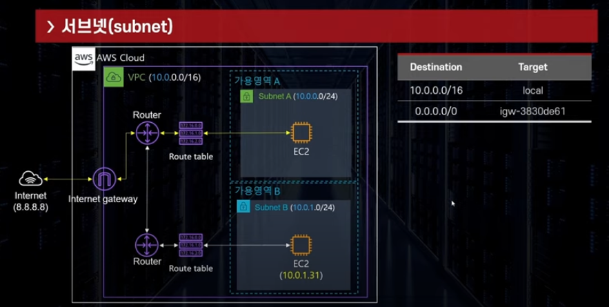

## Internet Gateway
```commandline
- VPC가 외부의 인터넷과 통신하는 경로를 만들어주는 리소스
- 1 VPC = 1 IGW 로 연결
- IGW와 함께 Router 및 Router Table설정이 있어야 인터넷 연결가능
```

<br/>

public subnet과는 다르게 private subnet은 IGW로 가는 경로가 없음


internet gateway 통신 예제

<br/>
