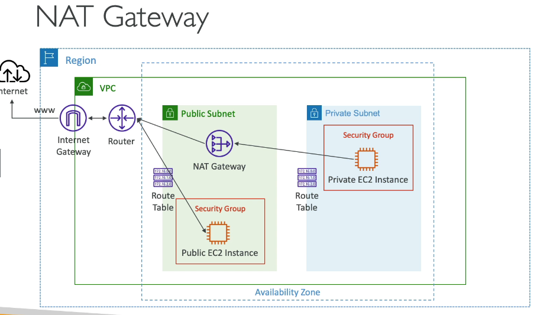

## Nat GateWay
- private subnet instance가 인터넷 연결이 필요할 때 사용
- 내부에선 외부로 접근가능, 외부에선 내부로 접근이 불가능
- 특정 AZ에 생성되고, 탄력적 IP를 이어받음
- 5 Gps of Bandwith ( 최대 45 Gps 오토스케일링 )
- 보안그룹 설정이 필요 없음

### 기본설정
IGW와 함께 사용시 private subnet -> NatGW -> IGW 로 구성

